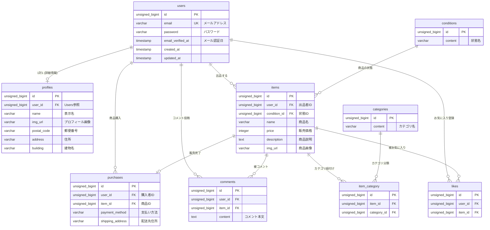

**coachtechフリマ (coachtech-furima)**

**1. 環境構築の手順**

**Dockerビルド**

git clone https://github.com/mikakoo731y-afk/coachtech-furima

cd contact-app

docker-compose up -d --build

**Laravel環境構築**

docker-compose exec php bash

composer install

cp .env.example .env

**データベース構築**

php artisan key:generate

php artisan migrate:fresh --seed

**2. 開発環境URL**

- **TOP画面:** http://localhost:8080
- **登録ページ:** 
- **phpMyAdmin:** http://localhost:8080

**3. 使用技術（実行環境）**

**言語・フレームワーク**
- **PHP:** 8.x
- **Laravel:** 8.x
- **Laravel Fortify:** 認証機能（ログイン・登録・ログアウト）の実装に使用

**データベース・ミドルウェア**
- **MySQL:** 8.0
- **Nginx:** 最新版
- **phpMyAdmin:** データベース管理用

**開発インフラ**
- **Docker / Docker Compose:** 開発環境のコンテナ化
- **Laravel Sail:** Docker環境の操作・管理

**主要な実装機能（バリデーション等**
- **FormRequest:** ユーザー側および管理者側の入力バリデーションに使用
- **Eloquent Factory / Seeder:** テストデータ（35件）および初期カテゴリーデータの生成
- **Laravel Blade:** フロントエンド（ユーザー画面・管理者画面）の構築

**4.ER図**
